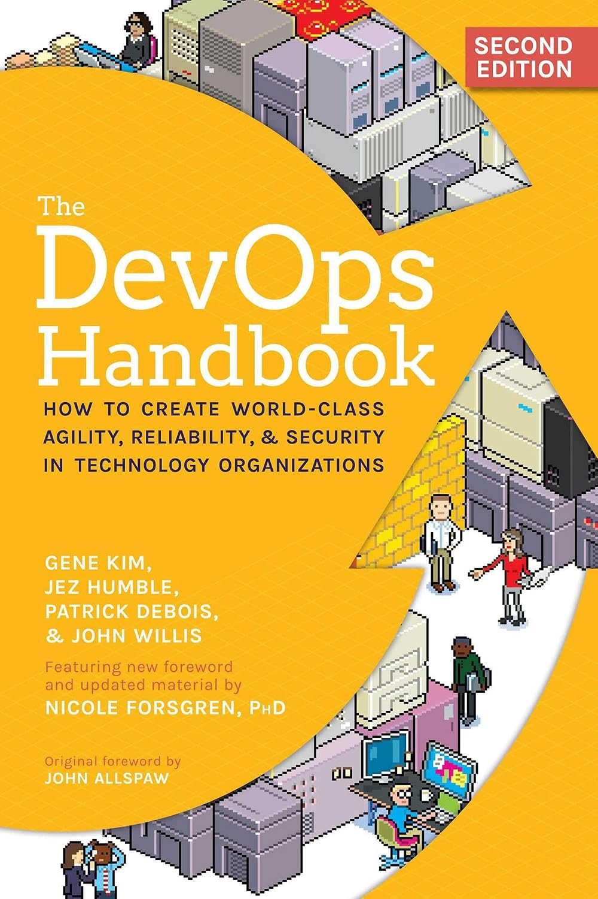
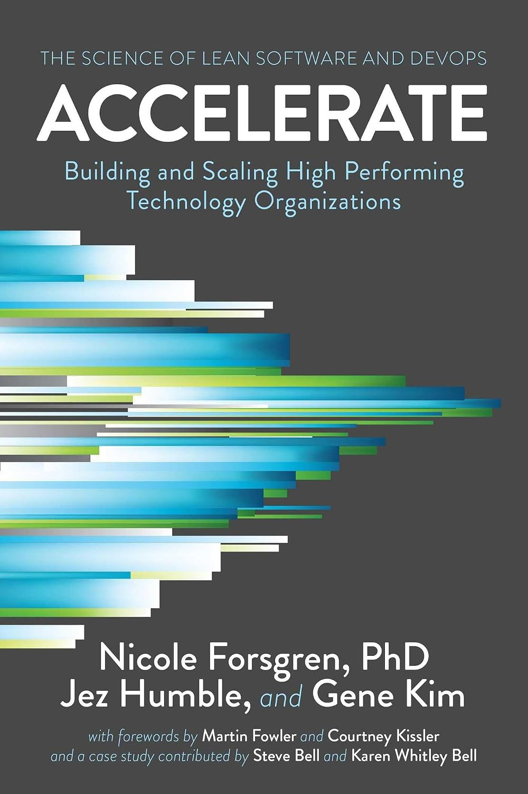
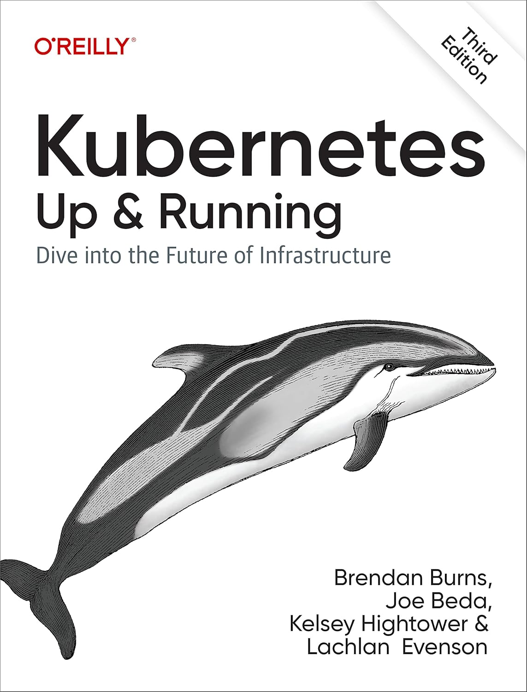

  <h1>Engenharia DevOps</h1>
  <h1>🏗️⚙️📊</h1>

<!-- Sistemas Operacionais -->

<!-- Versionamento / DevOps -->

<!-- Containers -->

<!-- Infraestrutura -->

<!-- Banco de Dados -->

<!-- Observabilidade -->

<!-- GitOps -->

<!-- Segurança -->

---

## 📘 Sobre o curso

Este repositório contém o material oficial do curso Engenharia DevOps, desenvolvido para apresentar os fundamentos, práticas, arquiteturas e tecnologias utilizadas na construção e operação de plataformas modernas de software.

O curso adota uma abordagem End-to-End, percorrendo todas as etapas do ciclo de vida da entrega de software, desde o desenvolvimento até a operação em produção, integrando conceitos de Engenharia de Software, Infraestrutura como Código (IaC), Integração e Entrega Contínuas (CI/CD), Containers, Kubernetes, Observabilidade e Segurança.

O objetivo não é ensinar só as ferramentas, e sim formar profissionais capazes de compreender os fundamentos da Engenharia DevOps, analisar alternativas técnicas, avaliar trade-offs e tomar decisões fundamentadas na construção e evolução de plataformas modernas.

Ao longo do curso, todas as tecnologias são apresentadas a partir de sua motivação, evolução, arquitetura, funcionamento interno, principais funcionalidades e aplicações práticas.

---

## 👥 Público-alvo

Este curso é destinado a:

- Desenvolvedores de Software;
- Engenheiros de Software;
- Estudantes da área de Tecnologia da Informação.

---

## ✔️ Pré-requisitos

É esperado que o aluno possua:

- Conhecimentos básicos de programação
- Familiaridade com Git
- Familiaridade com desenvolvimento de sistemas e bancos de dados

---

## 📚 Livros utilizados como referência

  
  
  

- **Kim, G.; Humble, J.; Debois, P.; Willis, J.**
  *The DevOps Handbook: How to Create World-Class Agility, Reliability, and Security in Technology Organizations*. 2 ed. IT Revolution Press, 2021.

- **Forsgren, N.; Humble, J.; Kim, G.**  
  *Accelerate: The Science of Lean Software and DevOps: Building and Scaling High Performing Technology Organizations*. 1st ed. IT Revolution Press, 2018.

- **Burns, B.; Beda, J.; Hightower, K.; Evenson, L.**  
  *Kubernetes: Up & Running: Dive into the Future of Infrastructure*. 3rd ed. O’Reilly Media, 2022.

---

## 📖 Documentação das ferramentas

Durante o curso, serão utilizadas as seguintes tecnologias e plataformas:

### Sistemas Operacionais

- [Ubuntu](https://ubuntu.com/tutorials)

### Controle de Versão

- [Git](https://git-scm.com/doc)
- [GitHub Docs](https://docs.github.com/)
- [GitLab Docs](https://docs.gitlab.com/)

### Integração e Entrega Contínuas (CI/CD)

- [GitHub Actions](https://docs.github.com/actions)
- [GitLab CI/CD](https://docs.gitlab.com/ee/ci/)

### Containers e Orquestração

- [Docker](https://docs.docker.com/)
- [Docker Compose](https://docs.docker.com/compose/)
- [Kubernetes](https://kubernetes.io/docs/)
- [MicroK8s](https://microk8s.io/docs)
- [Helm](https://helm.sh/docs/)

### Infraestrutura como Código

- [OpenTofu](https://opentofu.org/docs/)
- [Terraform](https://developer.hashicorp.com/terraform/docs)

### GitOps

- [Argo CD](https://argo-cd.readthedocs.io/)
- [Flux](https://fluxcd.io/flux/)

### Mensageria

- [RabbitMQ](https://www.rabbitmq.com/documentation.html)
- [Apache Kafka](https://kafka.apache.org/documentation/)

### Observabilidade

- [Prometheus](https://prometheus.io/docs/)
- [Grafana](https://grafana.com/docs/)
- [Loki](https://grafana.com/docs/loki/latest/)
- [OpenTelemetry](https://opentelemetry.io/docs/)
- [Datadog](https://docs.datadoghq.com/)

### Proxy Reverso

- [NGINX](https://nginx.org/en/docs/)

### Segurança

- [Trivy](https://trivy.dev/latest/docs/)
- [Gitleaks](https://github.com/gitleaks/gitleaks)
- [Cosign](https://docs.sigstore.dev/cosign/overview/)
- [OWASP DevSecOps Guideline](https://owasp.org/www-project-devsecops-guideline/)

---
## 🗂️ Estrutura do curso

### Módulo 1 — Fundamentos da Engenharia DevOps

#### 1.1 Introdução à Engenharia DevOps
- História da Engenharia de Software
- Surgimento do DevOps
- Cultura DevOps
- CALMS
- DevOps Lifecycle
- Integração entre Desenvolvimento e Operações
- Engenharia DevOps moderna

*Material de apoio*
- 🖼️ [Slide](https://canva.link/y97anu729365xka)

  
<em>Referências</em>

- *Kim, Prefácio; Parte I — Introdução*
- *Kim, Cap. 1 — Agile, Continuous Delivery, and the Three Ways*
- *Kim, Cap. 4 — The Third Way: The Principles of Continual Learning and Experimentation*
- *Kim, Cap. 8 — How to Get Great Outcomes by Integrating Operations into the Daily Work of Development*
- *Forsgren, Cap. 1–2*
- *Forsgren, Cap. 3 (p. 29–40) — Measuring and Changing Culture*
- *Forsgren, Cap. 4 (p. 41–57) — Technical Practices*
- *Forsgren, Cap. 5 (p. 59–68) — Architecture*
- *Forsgren, Cap. 7–8*
- *Forsgren, Apêndice A — Capabilities to Drive Improvement*

---

#### 1.2 Linux para Engenharia DevOps
- Estrutura do Linux
- Sistema de arquivos
- Permissões
- Usuários e grupos
- Processos
- Serviços (systemd)
- Bash
- Automação com Shell Script

*Material de apoio*
- ...

*Referências*
- ...

---

#### 1.3 Fundamentos de Redes
- Modelo TCP/IP
- HTTP
- DNS
- TLS
- SSH
- Balanceamento
- Reverse Proxy
- Nginx

*Material de apoio*
- ...

*Referências*
- ...

---

### Módulo 2 — Controle de Versão

#### 2.1 Git

- História
- Modelo Distribuído
- Branches
- Merge
- Rebase
- Tags
- Releases
- Git Flow

*Material de apoio*
- ...

*Referências*
- ...

---

#### 2.2 GitHub

- Repositórios
- Pull Requests
- Issues
- Actions
- Packages
- Wiki

*Material de apoio*
- ...

*Referências*
- ...

---

#### 2.3 GitLab

- Comparação com GitHub
- Merge Requests
- Pipelines
- Registry
- Self-hosted

*Material de apoio*
- ...

*Referências*
- ...

---

### Módulo 3 — Integração e Entrega Contínuas

#### 3.1 Continuous Integration (CI)

- Build
- Testes
- Artefatos
- Pipelines
- Estratégias

*Material de apoio*
- ...

*Referências*
- ...

---

#### 3.2 Continuous Delivery e Deployment (CD)

- Estratégias de Deploy
- Blue/Green
- Rolling Update
- Canary

*Material de apoio*
- ...

*Referências*
- ...

---

#### 3.3 Projeto

- Automatização completa do pipeline

*Material de apoio*
- ...

*Referências*
- ...

---

### Módulo 4 — Containers

#### 4.1 Docker

- Arquitetura
- Images
- Containers
- Layers
- Dockerfile
- Volumes
- Networks

*Material de apoio*
- ...

*Referências*
- ...

---

#### 4.2 Docker Compose

- Multi-container
- Redes
- Volumes
- Banco de dados
- Aplicações completas

*Material de apoio*
- ...

*Referências*
- ...

---

#### 4.3 Projeto

- Containerização da plataforma

*Material de apoio*
- ...

*Referências*
- ...

---

### Módulo 5 — Kubernetes

#### 5.1 Fundamentos

- Arquitetura
- Control Plane
- Nodes
- Pods
- ReplicaSets
- Deployments

*Material de apoio*
- ...

*Referências*
- ...

---

#### 5.2 Operação

- Services
- Ingress
- ConfigMaps
- Secrets
- Storage
- Helm

*Material de apoio*
- ...

*Referências*
- ...

---

#### 5.3 Workloads Distribuídos e Mensageria

- Arquiteturas assíncronas e orientadas a eventos
- RabbitMQ
- Apache Kafka
- Deploy e operação de brokers
- Persistência e alta disponibilidade
- Escalabilidade de Consumers
- Monitoramento e troubleshooting

*Material de apoio*
- ...

*Referências*
- ...

---

#### 5.4 GitOps

- Conceito de GitOps
- Git como fonte de verdade
- Estado desejado e reconciliação
- Push vs Pull deployment
- GitOps com Kubernetes
- Argo CD
- Flux

*Material de apoio*
- ...

*Referências*
- ...

---

#### 5.5 Projeto

- Deploy da plataforma em Kubernetes

*Material de apoio*
- ...

*Referências*
- ...

---

### Módulo 6 — Observabilidade

#### 6.1 Monitoramento

- Fundamentos de Observabilidade
- Métricas
- Prometheus
- Grafana
- Alertas

*Material de apoio*
- ...

*Referências*
- ...

---

#### 6.2 Logging e Tracing

- Logs centralizados
- Loki
- Distributed Tracing
- OpenTelemetry
- Correlação entre logs, métricas e traces

*Material de apoio*
- ...

*Referências*
- ...

---

#### 6.3 Observabilidade com Datadog

- Infrastructure Monitoring
- Kubernetes Monitoring
- Logs
- APM e Tracing
- Dashboards e Alertas

*Material de apoio*
- ...

*Referências*
- ...

---

#### 6.4 Projeto

- Observabilidade completa da plataforma

*Material de apoio*
- ...

*Referências*
- ...

---

### Módulo 7 — Infraestrutura Moderna

#### 7.1 Infraestrutura como Código (IaC)

- OpenTofu
- Terraform
- Providers
- States

*Material de apoio*
- ...

*Referências*
- ...

---

#### 7.2 Computação em Nuvem

- Fundamentos de Cloud Computing
- IaaS, PaaS e SaaS
- Regiões e Zonas de Disponibilidade
- Serviços Gerenciados e Self-hosted
- Escalabilidade e Alta Disponibilidade
- Custos e modelos de cobrança
- Cloud Agnostic

*Material de apoio*
- ...

*Referências*
- ...

---

#### 7.3 Projeto

- Provisionamento da infraestrutura

*Material de apoio*
- ...

*Referências*
- ...

---

### Módulo 8 — DevSecOps

#### 8.1 Segurança

- DevSecOps
- Supply Chain Security
- Trivy
- Gitleaks
- Cosign

*Material de apoio*
- ...

*Referências*
- ...

---

#### 8.2 Projeto

- Integração da segurança ao pipeline

*Material de apoio*
- ...

*Referências*
- ...

---

### Módulo 9 — Engenharia de Plataforma

#### 9.1 Operação

- SRE
- SLI
- SLO
- SLA
- Error Budget
- FinOps
- Platform Engineering

*Material de apoio*
- ...

*Referências*
- ...

---

#### 9.2 Automação

- Bash
- Python

*Material de apoio*
- ...

*Referências*
- ...

---

#### 9.3 Projeto Final

- Evolução da plataforma para ambiente de produção

*Material de apoio*
- ...

*Referências*
- ...

---

### Módulo 10 — Inteligência Artificial aplicada ao DevOps

#### 10.1 IA aplicada à Engenharia DevOps

- Agentes para automação operacional
- IA para observabilidade
- IA para análise de incidentes
- IA para operação de plataformas
- Tendências

*Material de apoio*
- ...

*Referências*
- ...

---

## 👤 Sobre o autor

<table>
  <tr>
    <td width="200" valign="top" align="center">
      
    </td>
    <td valign="top">
      

        Estudante do Bacharelado em Tecnologia da Informação pela Universidade Federal do Rio Grande do Norte (UFRN).
        Trabalha com Engenharia de Software e IA. Foi estagiário no Senac RN, trabalhando nas mesmas frentes.
        Participou do projeto de pesquisa "IApps: desenvolvimento e entrega de aplicativos inteligentes no contexto de áreas emergentes",
        onde publicou diversos artigos nacionais e um artigo internacional, que já conta com mais de 200 visualizações e 4 citações.
        Também foi pesquisador no InovAI Lab, no plano de trabalho "Aprendizagem Profunda Aplicada à Predição de Risco de Mortalidade em
        Recém-nascidos Prematuros" onde foi selecionado para concorrer o 8º prêmio destaque na iniciação científica e tecnológica da UFRN.
        Além disso, atuou como bolsista do Programa de Educação Tutorial (PET) de Ciência da Computação da UFRN e como bolsista de Apoio
        Técnico-Científico no Instituto Metrópole Digital (IMD/UFRN), colaborando com a equipe da plataforma Objetos de Aprendizagem para
        Matemática (OBAMA), onde iniciou sua atuação na área de Ciência de Dados.
      

    </td>
  </tr>
</table>

---

## ⚖️ Licença

Este repositório está licenciado sob a **Creative Commons Attribution–NonCommercial–NoDerivatives 4.0 International (CC BY-NC-ND 4.0)**.

### ✅ Você pode

- Compartilhar o conteúdo para fins educacionais e não comerciais
- Utilizar o material para estudo pessoal

### ❌ Você não pode

- Utilizar o conteúdo para fins comerciais
- Modificar, adaptar ou criar obras derivadas
- Redistribuir versões modificadas do material

Para mais informações, consulte o arquivo [LICENSE](LICENSE) ou a licença oficial em:  
https://creativecommons.org/licenses/by-nc-nd/4.0/deed.pt-br

